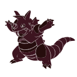

.. Rhyton documentation master file, created by
   sphinx-quickstart on Mon Mar 20 11:30:14 2023.
   You can adapt this file completely to your liking, but it should at least
   contain the root `toctree` directive.

Rhyton
======

.. container:: .large

   `Rhyton <https://github.com/herzogdemeuron/rhyton>`_ is a data management and visualization core for McNeel's Rhinoceros 3D.
   It's purpose is to provide common data handling platform for other extensions such as
   `BIMlight <https://github.com/herzogdemeuron/BIMlight>`_ 

.. container:: .buttons

   `Docs <rhyton.html>`_
   `GitHub <https://github.com/herzogdemeuron/rhyton>`_

.. toctree::
   :caption: Rhyton:
   :maxdepth: 2
   :hidden:

   rhyton
   genindex

.. toctree::
   :caption: More
   :hidden:

   GitHub <https://github.com/herzogdemeuron/rhyton>